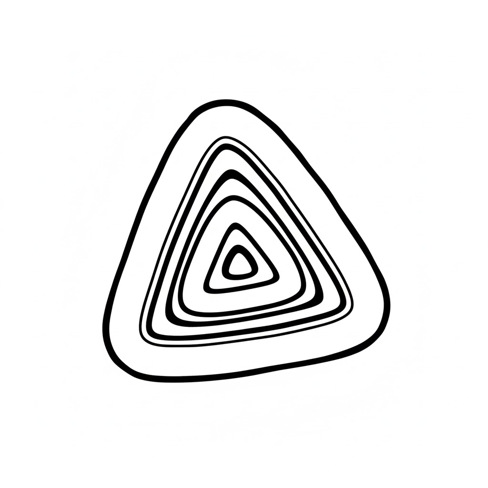

# Welcome to Tuck organization page...

  

### Redefining the Future of Sovereign Computing

We are a technology entity dedicated to returning digital agency to the individual. Our mission is to engineer the infrastructure for a world where artificial intelligence is powerful, autonomous, and—above all—private.

---

## 🏢 Corporate Mission
Our organization was founded on the belief that the current "Cloud-First" paradigm is fundamentally incompatible with true privacy and personal sovereignty. We build the software orchestration layers of tomorrow, ensuring that the intelligence powering your life remains under your exclusive control.

## 🛡️ Strategic Pillars
At the corporate level, our work is guided by three core principles:

1. **Privacy as a Right:** We develop architectures where data processing is localized by default. We do not monetize user data; we monetize the intelligence and security of our systems.
2. **Protocol Interoperability:** We aim to bridge fragmented standards (IoT, Telecom, Web) into a single, cohesive interface, removing the limitations of "Walled Gardens."
3. **Agentic Future:** We move beyond reactive tools. Our focus is on building "Autonomous Agents"—software capable of understanding complex human intent and executing it across digital and physical domains.

## 🚀 Our Portfolio
While **T.U.C.K. (Trusted User-centric Companion Kit)** is our flagship domestic orchestrator, our organization is committed to building a broader ecosystem of sovereign tools:

* **Intelligent Orchestration:** Advanced reasoning engines designed for high-performance local deployment.
* **Secure Communications:** VoIP and telecommunications bridges that prioritize encryption and user anonymity.
* **Software-Hardware Integration:** Universal middleware designed to interface seamlessly with modern smart infrastructure and Home Lab setups.

## 🤝 Philosophy & Open Source
We operate under a transparency-first model. By maintaining a strong presence in the open-source community, we allow for independent auditing of our security protocols. We believe that "Trust" is earned through technical proof and architectural integrity, not marketing.

## 📂 Organizational Structure
Our repositories are organized by technical domain to support specialized development across our ecosystem:

* **Intelligence:** Core LLM routing and reasoning logic.
* **Connectivity:** Bridge modules for IoT and external API protocols.
* **Interface:** Human-computer interaction layers including Voice, Web, and Mobile.

## 📧 Contact & Business
For inquiries regarding our technology, B2B licensing for sovereign environments, or potential partnerships in the private AI space, please contact our lead development team through the official channels listed on our website.

---
*Empowering individuals through sovereign intelligence.*
